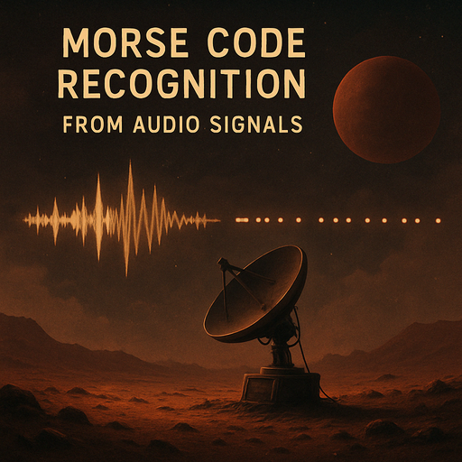

# Распознавание кода морзе из аудиосигналов



## Описание задачи

Этот проект посвящен разработке и обучению модели глубокого обучения для распознавания азбуки морзе непосредственно из аудиофайлов. Задача была поставлена в рамках соревнования, имитирующего сценарий получения загадочного, слабого сигнала на марсе, предположительно с земли, после долгого периода молчания.

**Основные цели:**
1.  Создать модель машинного обучения, способную декодировать код морзе из аудиосигналов формата `.opus`.
2.  Расшифровать особое, повторяющееся сообщение, закодированное в последних 17 аудиофайлах тестового набора данных (задача со звездочкой ⭐).

**Метрика качества:** усредненное расстояние левенштейна (levenshtein mean) между предсказанными моделью и истинными текстовыми сообщениями. лидерборд соревнования kaggle рассчитывается на основе примерно 50% тестовых данных, а финальный результат — на оставшихся 50%.

## Структура проекта

Проект организован следующим образом для ясности и удобства использования:

```
morse_decoder_project/
├── .gitignore                 # файлы и папки, игнорируемые git
├── README.md                  # этот файл
├── requirements.txt           # зависимости python
├── Image_mars.png             # главное изображение
├── architecture.png           # изображение диаграммы архитектуры
│
├── data/                      # папка для данных
│   └── morse_dataset/
│       └── morse_dataset/     # аудио файлы .opus
│   ├── train.csv              # обучающие данные (id, message)
│   ├── test.csv               # тестовые данные (id)
│   └── sample_submission.csv  # пример файла для отправки
│   └── logbook.txt            # журнал колонии с контекстом и подсказками
│
├── notebooks/                 
│   └── Morse.ipynb
│
├── output/                    # для сохраняемых артефактов (модели, графики, сабмиты)
│   ├── best_model.pth         # пример лучшей модели
│   ├── training_plot.png      # пример графика обучения
│   └── submission.csv         # пример файла с предсказаниями
│
├── scripts/                   # исполняемые python скрипты
│   ├── train.py               # скрипт для запуска обучения модели
│   ├── inference.py           # скрипт для генерации предсказаний на тестовых данных
│   └── visualize_data.py      # скрипт для визуализации данных/аугментаций
│
└── src/                       # основной исходный код модулей проекта
    ├── __init__.py
    ├── config.py              # конфигурация: гиперпараметры, пути по умолчанию
    ├── utils.py               # вспомогательные функции (seed, очистка текста, словарь)
    ├── dataset.py             # класс dataset и функции collate
    ├── audio_processing.py    # функции/трансформы для обработки аудио (спектрограммы, аугментации)
    ├── model.py               # определение архитектуры нейронной сети (seblock, crnn_se_proj)
    └── engine.py              # логика обучения и валидации (циклы эпох, декодер, метрики)
```

## Установка

Для запуска проекта локально выполните следующие шаги:

1.  **Склонируйте репозиторий:**
    ```bash
    git clone https://github.com/aak204/morse_decoder_project.git
    cd morse_decoder_project
    ```
2.  **Создайте и активируйте виртуальное окружение** (настоятельно рекомендуется):
    ```bash
    python -m venv venv
    # для linux/macos:
    source venv/bin/activate
    # для windows (cmd/powershell):
    # venv\Scripts\activate
    ```
3.  **Установите необходимые зависимости:**
    ```bash
    pip install -r requirements.txt
    ```
    *примечание:* для корректной работы `torchaudio` может потребоваться установка системной библиотеки `libsndfile` (для linux) или `ffmpeg`.

## Данные

*   **Источник:** данные предоставлены в рамках соревнования (например, kaggle).
*   **Расположение:** скрипты ожидают найти данные в папке `data/` в корне проекта. структура внутри `data/` должна соответствовать описанной выше. пути можно изменить в `scripts/train.py` и `scripts/inference.py` или в `src/config.py`.
*   **Формат:**
    *   аудио: файлы `.opus`, частота дискретизации 8 кгц.
    *   метаданные: `train.csv` (содержит `id` файла и соответствующее `message`), `test.csv` (содержит `id` файлов для предсказания).
    *   контекст: `logbook.txt` содержит записи бортового журнала марсианской колонии.

## Конфигурация

Основные параметры модели, обучения и обработки данных задаются в файле `src/config.py`. это позволяет легко экспериментировать с настройками, не изменяя основной код скриптов. ключевые параметры включают:

*   параметры аудио: `SAMPLE_RATE`, `N_MELS`, `N_FFT`, `HOP_LENGTH`.
*   параметры модели: `CNN_OUT_CHANNELS`, `RNN_HIDDEN_SIZE`, `RNN_LAYERS`, `NUM_HEADS`, `DROPOUT`.
*   параметры аугментации: `FREQ_MASK_PARAM`, `TIME_MASK_PARAM`.
*   параметры обучения: `SEED`, `BATCH_SIZE`, `EPOCHS`, `LEARNING_RATE`, `WEIGHT_DECAY`, `EARLY_STOPPING_PATIENCE`.

## Использование

### Обучение модели

Для запуска процесса обучения выполните скрипт `train.py`:

```bash
python scripts/train.py
```

*   Скрипт автоматически определит среду выполнения (kaggle или локальную) и установит соответствующие пути к данным и папке вывода.
*   Он загрузит данные, создаст словарь, инициализирует модель и запустит цикл обучения согласно параметрам в `src/config.py`.
*   В процессе обучения будет отслеживаться метрика расстояния левенштейна на валидационном наборе.
*   Лучшая модель (по минимальному расстоянию левенштейна на валидации) будет сохранена в папку `output/` (например, `output/best_morse_cnn_se_proj_gru_mha_h512_refactored_model.pth`).
*   График процесса обучения (loss и levenshtein) также будет сохранен в `output/`.

### Генерация предсказаний (инференс)

После обучения модели можно сгенерировать файл с предсказаниями (`submission.csv`) для тестового набора данных:

```bash
python scripts/inference.py --model_path output/best_morse_cnn_se_proj_gru_mha_h512_refactored_model.pth
```

*   Замените путь в аргументе `--model_path` на путь к вашему сохраненному файлу `.pth`.
*   Скрипт загрузит тестовые данные, указанную модель, выполнит предсказания с использованием жадного ctc-декодера.
*   Результирующий файл `submission_....csv` будет сохранен в папку `output/`.
*   Пути к данным и выводу можно также переопределить через аргументы командной строки `--data_dir` и `--output_dir`.

## Архитектура модели

В качестве основной архитектуры используется сверточно-рекуррентная нейронная сеть (crnn) с несколькими улучшениями для повышения качества распознавания:

1.  **Вход:** mel-спектрограмма, полученная из исходного аудиосигнала.
2.  **Сверточный блок (cnn):** состоит из нескольких слоев `conv2d`, `batchnorm2d`, активации `gelu` и `maxpool2d`. этот блок извлекает локальные частотно-временные признаки. для улучшения качества признаков используются блоки **squeeze-and-excitation (se)**, которые динамически взвешивают важность различных каналов признаков.
3.  **Проекционный слой:** линейный слой (`nn.linear`) преобразует выход cnn блока к размерности, ожидаемой рекуррентным слоем.
4.  **Рекуррентный блок (rnn):** используется двунаправленный `gru` (`nn.gru`) для моделирования последовательности признаков во времени и учета контекста.
5.  **Multi-head attention (mha):** слой внимания (`nn.multiheadattention`) применяется к выходам rnn. он позволяет модели взвешивать важность различных временных шагов при формировании финального представления. используется вместе с остаточной связью (residual connection) и нормализацией слоя (`nn.layernorm`).
6.  **Классификатор (fc):** финальный линейный слой (`nn.linear`) предсказывает распределение вероятностей по словарю символов для каждого временного шага.
7.  **Выход:** применяется функция `log_softmax` для получения логарифмов вероятностей, которые используются функцией потерь ctc loss.

**Диаграмма архитектуры:**


## Подходы и эксперименты

В процессе разработки были исследованы и опробованы различные методики и архитектурные решения.

*   **Базовая модель:** начальная точка - стандартная архитектура crnn.
*   **Улучшения архитектуры:** последовательное добавление блоков se в cnn, проекционного слоя, двунаправленного gru и слоя multi-head attention.
*   **Аугментации:**
    *   **specaugment:** маскирование по времени и частоте на mel-спектрограммах. параметры подбирались, в итоговой версии используются умеренные значения (`FREQ_MASK_PARAM=30`, `TIME_MASK_PARAM=60`). проводились эксперименты с отключением и изменением интенсивности.
    *   **waveform аугментации:** эксперименты с добавлением гауссовского шума, изменением скорости (time stretch) и громкости к сырому аудио.
*   **Декодирование:** основной метод - жадный ctc декодер. beam search (с языковой моделью и без) не показал стабильного улучшения для данной конфигурации.
*   **Другие архитектуры:** были предприняты попытки обучения моделей conformer и fine-tuning wav2vec2, но они не превзошли оптимизированную crnn-архитектуру на данном наборе данных и при текущих настройках.
*   **Валидация:** использовался как простой отложенный валидационный набор (85% train / 15% val), так и k-fold кросс-валидация. итоговая модель обучена на простом split'е.

## Результаты

*   **Лучшая модель (представленная в этом репозитории):**
    *   валидация (levenshtein mean per sample): ~0.24 (достигнуто на одной из эпох)
    *   kaggle public leaderboard: ~0.36
*   **Разрыв между валидацией и lb:** наблюдается разница в метриках, что типично для kaggle. возможные причины: некоторое переобучение под валидационный набор, различия в распределении данных между val и public lb, оценка lb только на части тестовых данных.

## Задача со звездочкой ⭐: расшифровка сообщения

Согласно `logbook.txt`, последние 17 аудиофайлов содержат важное, повторяющееся сообщение. анализ предсказаний модели для этих файлов, с учетом типичных ошибок (в основном замены символов) и контекста задачи, позволил предложить следующую интерпретацию исходного сообщения (формат `id,message`):

```
34983.opus,ЗАПРОС
34984.opus,ДАННЫЕ ПРИНЯТЫ
34985.opus,ИДЕТ ОБРАБОТКА
34986.opus,ПОМЕХИ УРОВЕНЬ
34987.opus,СИГНАЛ СЛАБЫЙ
34988.opus,ПОВТОР ТРЕБУЕТСЯ
34989.opus,КООРДИНАТЫ
34990.opus,ИСТОЧНИК НЕИЗВЕСТЕН
34991.opus,ДАННЫЕ ЕСТЬ
34992.opus,АНАЛИЗ
34993.opus,ГОТОВ
34994.opus,ОТЧЕТ
34995.opus,ОЖИДАЙТЕ
34996.opus,ПЕРЕДАЧА ДАННЫХ
34997.opus,СЕАНС
34998.opus,ЗАВЕРШЕН
34999.opus,ПРИЕМ
35000.opus,КОНЕЦ СВЯЗИ
```

## Лицензия

Этот проект распространяется под лицензией mit. см. файл `LICENSE` для подробностей.
